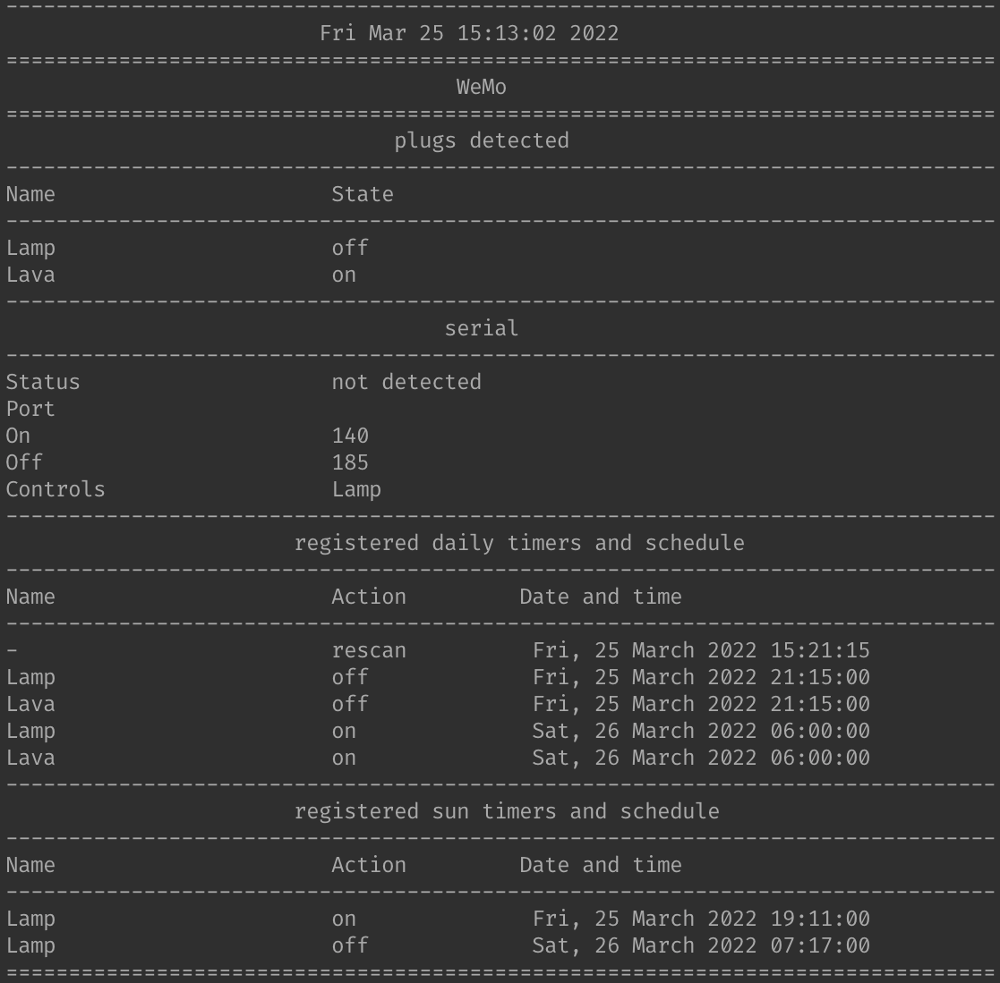

# WeMo Smart Plug Control

## Description

Daemon for controlling [WEMO](https://www.wemo.com/products) Mini Smart Plugs.
The daemon will turn different plugs on/off on a user specified schedule that is
configured via an `ini`-file. There are two versions, one written in C++, the
other in PHP. The C++\-version is far more mature with support for `serial`
control, for example, when the brightness in a room passes a certain threshold
plugs can be turned on or off, and uses `inotify` to monitor changes made to the
configuration file. Furthermore, the C++\-version can trigger on sunset/rise,
and does log-rotation.
Sun-set/rise times are provided via
[sunrise-sunset.org](https://sunrise-sunset.org/api).



## Usage

The C++\-version of the daemon is compiled by calling `make` in the cpp-directory.

```shell
make
```

The daemon is invoked via

```shell
./wemod &
```

in case of the C++\-version and via

```shell
./php wemod.php &
```

in case of the PHP-version.

Below is a `wemo.ini` example configuration file.

```INI
[global]
latitude=37.386051
longitude=-122.083855
; rescan interval in seconds
rescan=600

[serial]
port=/dev/cu.usbmodem14101
baudrate=115200
onlux=400
offlux=500
controls=Lamp,Christmas Lights

[Lamp]
daily=true
ontimes=7:00,12:10
offtimes=8:30,22:00,22:30

[Christmas Lights]
daily=true
; different schedule for the workweek and weekends
ontimes=6:00%2-6,8:00%17
offtimes=22:00
sun=true
```

The `ini`-file contains two sections, one named `global` and the other `serial`,
that control daemon behavior. How often the daemon checks for new/removed plugs
is configured via the `rescan` key under `global`, where its value is expressed
in seconds. Configuration of the serial port is done under the `serial` section,
where `port`, `baudrate`, `onlux`, `offlux`, and `control` keys set the serial
port, baud rate, lower threshold, upper threshold, and which plugs to control,
respectively. Each plug has its own section that is identified by its name,
where the `daily` key is either set to true or false to indicate a daily
schedule, and the `ontimes` and `offtimes` keys are comma-separated lists of
times, expressed using 24-hour notation, to turn a given plug on and off,
respectively. Optionally, the day of the week, 1-7 starting on Sunday, can be specified
following a '%'.

The daemons responds to the `SIGUSR1` and `SIGUSR2` signal, where the former forces a re-scan and the latter writes a summary of the daemon's state and the registered timers to `wemo.log`.

## Notes

1. Due to its dependence the on `inotify`, the C++\-version will not compile on all systems, i.e., those without `inotify` support, e.g., MacOS.
2. The PHP-version might require enabling certain functionality via `php.ini` or could simply not be available on a particular system. For example, the `pcntl_*` family of functions are not available on systems that do not implement the underlying C function, e.g., MacOS and FreeBSD.
3. The PHP-version does not make use of the `global` and `serial` sections, but has an `interface` key, without a section, that controls the network interface to use.
4. There are slight differences in implementation details that are dependent on the language being used. For example, PHP has the `parse_ini_file` function that needs an implementation in C++.
5. The C++-version relies on [`OpenSSL`](https://www.openssl.org) for internet requests and [`RapidJSON`](https://rapidjson.org) to parse [`JSON`](https://www.json.org) responses.

## BSD-3 License

Redistribution and use in source and binary forms, with or without modification, are permitted provided that the following conditions are met:

1. Redistributions of source code must retain the above copyright notice, this list of conditions and the following disclaimer.

2. Redistributions in binary form must reproduce the above copyright notice, this list of conditions and the following disclaimer in the documentation and/or other materials provided with the distribution.

3. Neither the name of the copyright holder nor the names of its contributors may be used to endorse or promote products derived from this software without specific prior written permission.

THIS SOFTWARE IS PROVIDED BY THE COPYRIGHT HOLDERS AND CONTRIBUTORS "AS IS" AND ANY EXPRESS OR IMPLIED WARRANTIES, INCLUDING, BUT NOT LIMITED TO, THE IMPLIED WARRANTIES OF MERCHANTABILITY AND FITNESS FOR A PARTICULAR PURPOSE ARE DISCLAIMED. IN NO EVENT SHALL THE COPYRIGHT HOLDER OR CONTRIBUTORS BE LIABLE FOR ANY DIRECT, INDIRECT, INCIDENTAL, SPECIAL, EXEMPLARY, OR CONSEQUENTIAL DAMAGES (INCLUDING, BUT NOT LIMITED TO, PROCUREMENT OF SUBSTITUTE GOODS OR SERVICES; LOSS OF USE, DATA, OR PROFITS; OR BUSINESS INTERRUPTION) HOWEVER CAUSED AND ON ANY THEORY OF LIABILITY, WHETHER IN CONTRACT, STRICT LIABILITY, OR TORT (INCLUDING NEGLIGENCE OR OTHERWISE) ARISING IN ANY WAY OUT OF THE USE OF THIS SOFTWARE, EVEN IF ADVISED OF THE POSSIBILITY OF SUCH DAMAGE.
